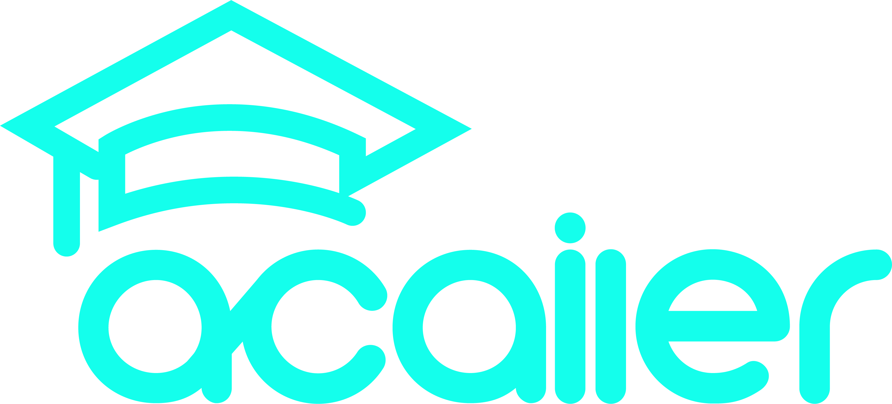

 

  
 <h3 align="center">Ai solution for the academic systems</h3>

![App Screens][product-screenshot]

Acailer is an academic assistant system powered by AI technologies that helps both students and instructors focus on the teaching and studying process more and leave the AI to do the work.
academic registration, attendance process, Arranging The Schedule, and managing course tasks like exams, sheets, and quizzes, besides the ability to get info and take actions with the ease of talking to the AI agent.

The system can handle:
* Academic Registration
* Attendance Process
* Arranging the schedule
* Managing course tasks like exams, sheets, and quizzes
* Get info and take actions with the ease of talking to the AI agent

[product-screenshot]: images/screens.png
